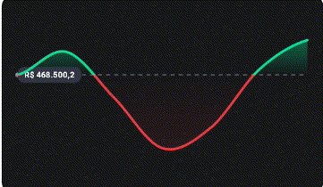
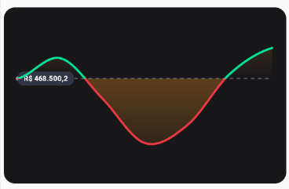
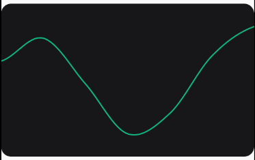
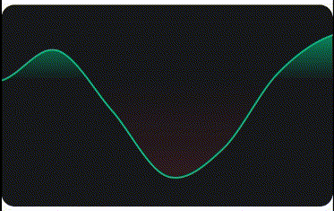
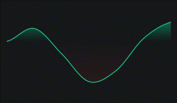

# 📈 React Native Finance Kit

<p align="center">
  
</p>

A **high-performance** financial charting library for React Native, built on the power of **Skia** and **Reanimated**.

Designed to render animations at **60/120 FPS** on the UI thread, with absolute touch precision (pixel-perfect) and support for complex gesture interactions.

## ✨ Highlights

- 🚀 **Native Performance:** GPU rendering via Skia.
- 👆 **Smooth Interaction:** Gestures run entirely on the UI Thread (Worklets).
- 🎯 **Pixel-Perfect Precision:** Hybrid algorithm using _Lookup Table_ + _Catmull-Rom_ ensures the cursor never drifts off the line.
- 🎨 **Customizable:** Colors, gradients, tooltips, and dimensions are fully adjustable.

## 📦 Installation

Since this library relies on powerful native modules, you must install the **Peer Dependencies**:

```bash
yarn add react-native-finance-kit

# Install required dependencies
yarn add @shopify/react-native-skia react-native-reanimated react-native-gesture-handler d3
```

> **Note for Expo:**
> If you are using Expo Go, ensure that the Skia and Reanimated versions are compatible with your SDK.
> It's recommended using **Development Builds** (`npx expo run:android`) for the best performance.

## ⚡ Basic Usage

```tsx
import React from 'react';
import { View } from 'react-native';
import { Chart } from 'react-native-finance-kit';
import { GestureHandlerRootView } from 'react-native-gesture-handler';

const data = [
  { timestamp: 1625945400000, value: 33575.25 },
  { timestamp: 1625946300000, value: 33545.25 },
  { timestamp: 1625947200000, value: 33510.25 },
  { timestamp: 1625948100000, value: 33215.25 },
];

export default function App() {
  return (
    <View
      style={{ flex: 1, justifyContent: 'center', backgroundColor: '#000' }}
    >
      <GestureHandlerRootView style={{ flex: 1, marginTop: 200 }}>
        <Chart.Root data={data} height={250}>
          <Chart.Canvas>
            <Chart.Area />
            <Chart.Line />
            <Chart.Cursor />
          </Chart.Canvas>

          <Chart.Tooltip.Value />
          <Chart.Tooltip.Date />
        </Chart.Root>
      </GestureHandlerRootView>
    </View>
  );
}
```

## 💡 Examples

Here are some common patterns to customize the chart to your needs.

### 1. Custom Colors (The "Bitcoin" Look)

Customize the line color and the area gradient to match specific assets (e.g., Orange for BTC, Blue for ETH).

```tsx
<Chart.Root data={data}>
  <Chart.Canvas>
    <Chart.Area
      // Gradient from transparent Orange to transparent
      gradientColors={['#F7931A50', '#F7931A00']}
    />
    <Chart.Line
      colors={['#F7931A']} // Solid Orange
      strokeWidth={4}
    />
    <Chart.Cursor crosshairColor="#F7931A" />
  </Chart.Canvas>
</Chart.Root>
```



### 2. Minimal Sparkline

A small, simplified chart without tooltips or padding, perfect for lists or crypto tickers.

```tsx
<Chart.Root
  data={data}
  height={60}
  width={120}
  padding={0} // Remove padding to touch edges
>
  <Chart.Canvas>
    <Chart.Line
      strokeWidth={2}
      colors={['#10B981', '#10B981', '#10B981', '#10B981']}
    />
  </Chart.Canvas>
  {/* No Tooltips, no Cursor */}
</Chart.Root>
```



### 3. Custom Currency Formatting (USD/EUR)

Use a Worklet to format values dynamically on the UI thread.

```tsx
const formatUSD = (value: number) => {
  'worklet';
  return `$ ${value.toFixed(2)}`;
};

const formatEUR = (value: number) => {
  'worklet';
  return `€ ${value.toFixed(2).replace('.', ',')}`;
};

// Usage
<Chart.Root data={data}>
  <Chart.Canvas>
    <Chart.Area />
    <Chart.Line />
    <Chart.Cursor />
  </Chart.Canvas>
  <Chart.ToolTip.Value format={formatUSD} />
</Chart.Root>;
```



### 4. Customizing the Tooltip Style

Change the background color and border radius of the floating tooltip.

```tsx
<Chart.Root data={data}>
  <Chart.Canvas>
    <Chart.Area />
    <Chart.Line />
    <Chart.Cursor />
  </Chart.Canvas>
  <Chart.Tooltip.Value
    containerStyle={{
      backgroundColor: 'white',
      borderRadius: 4,
      borderWidth: 1,
      borderColor: '#E5E7EB',
    }}
    style={{
      color: 'black',
      fontSize: 14,
    }}
  />
</Chart.Root>
```



## 🛠️ API Reference

### `<Chart.Root />`

The parent component that manages state and calculations.

| Prop             | Type          | Default        | Description                              |
| ---------------- | ------------- | -------------- | ---------------------------------------- |
| `data`           | `DataPoint[]` | **Required**   | `{ timestamp: number, value: number }[]` |
| `height`         | `number`      | `250`          | Total height of the chart                |
| `width`          | `number`      | `Screen Width` | Total width of the chart                 |
| `padding`        | `number`      | `20`           | Internal horizontal padding              |
| `containerStyle` | `ViewStyle`   | `{}`           | Styles for the main container            |

### `<Chart.Canvas />`

The wrapper for all Skia elements.

| Prop       | Type              | Default | Description                             |
| ---------- | ----------------- | ------- | --------------------------------------- |
| `children` | `React.ReactNode` | - - -   | Children element. Must be Skia elements |

### `<Chart.Line />`

Draws the main chart line.

| Prop          | Type       | Default                                        | Description                    |
| ------------- | ---------- | ---------------------------------------------- | ------------------------------ |
| `strokeWidth` | `number`   | `3`                                            | Line thickness                 |
| `colors`      | `string[]` | `['#00E396', '#00E396', '#EA3943', '#EA3943']` | Gradient colors (Top → Bottom) |

### `<Chart.Baseline />`

Draws a dashed horizontal line at the starting value (baseline). Useful for visualizing profit/loss.

| Prop        | Type      | Default   | Description                                              |
| ----------- | --------- | --------- | -------------------------------------------------------- |
| `color`     | `string`  | `#858CA2` | Color of the dashed line and starting dot.               |
| `showLabel` | `boolean` | `true`    | Whether to show the label chip with the formatted value. |

### `<Chart.Area />`

Draws the gradient fill below the line.

| Prop             | Type       | Default                            | Description                                                                      |
| ---------------- | ---------- | ---------------------------------- | -------------------------------------------------------------------------------- |
| `gradientColors` | `string[]` | `['#000', '#000', '#000', '#000']` | Array of 4 colors for the area gradient (Top -> Baseline -> Baseline -> Bottom). |

### `<Chart.Cursor />`

The interactive cursor that follows the finger.

| Prop             | Type     | Default   | Description                          |
| ---------------- | -------- | --------- | ------------------------------------ |
| `crosshairColor` | `string` | `'white'` | Color of the vertical line           |
| `circleColor`    | `string` | `'white'` | Border color of the indicator circle |

### `<Chart.Tooltip.Value />`

Displays the current interpolated value (price, score, etc).

| Prop             | Type                        | Default  | Description             |
| ---------------- | --------------------------- | -------- | ----------------------- |
| `format`         | `(value: number) => string` | `$ 0.00` | Format function         |
| `style`          | `TextStyle`                 | `{}`     | Inner text style        |
| `containerStyle` | `ViewStyle`                 | `{}`     | Tooltip container style |

### `<Chart.Tooltip.Date />`

Displays the current date/time.

| Prop             | Type                        | Default      | Description             |
| ---------------- | --------------------------- | ------------ | ----------------------- |
| `style`          | `TextStyle`                 | `{}`         | Inner text style        |
| `containerStyle` | `ViewStyle`                 | `{}`         | Tooltip container style |
| `format`         | `(value: number) => string` | `DD/MM/YYYY` | Timestamp formatter     |

## 🎨 Advanced Customization

### Formatting Currency (USD)

```ts
const formatUSD = (value: number) => {
  'worklet';
  return `$ ${value.toFixed(2)}`;
};

<Chart.Tooltip.Value format={formatUSD} />;
```

### Styling the Container

```tsx
<Chart.Root
  data={data}
  containerStyle={{
    backgroundColor: '#1E1E2D',
    borderRadius: 20,
    borderWidth: 1,
    borderColor: '#333',
  }}
>
```

## 🐛 Troubleshooting

**Error: `missing libsvg.a` or `skia` crash**

1. `cd android && ./gradlew clean`
2. `cd .. && rm -rf node_modules && yarn install`
3. Ensure `@shopify/react-native-skia` is compatible with your RN version.

**Error: `Reanimated failed to create a worklet`**

Add to `babel.config.js`:

```js
plugins: ['react-native-reanimated/plugin'],
```

## 🤝 Contributing

1. Fork the project
2. Create your Feature Branch (`git checkout -b feature/NewFeature`)
3. Commit your changes (`git commit -m 'Add some NewFeature'`)
4. Push to the Branch (`git push origin feature/NewFeature`)
5. Open a Pull Request

---

This library was inspired by the awesome [react-native-wagmi-charts](https://github.com/coinjar/react-native-wagmi-charts). Ideally, I aimed to create a performant Skia-based alternative with a similar easy-to-use API.

## 📄 License

Distributed under the MIT License. See `LICENSE` for more information.
