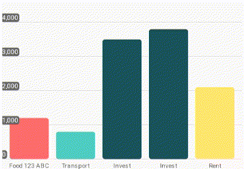
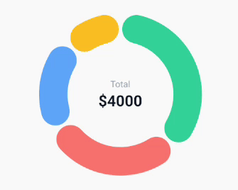

# 📈 React Native Financial Charts

<p align="center">


</p>

A **high-performance** financial charting library for React Native, built on the power of **Skia** and **Reanimated**.

Designed to render animations at **60/120 FPS** on the UI thread, with absolute touch precision (pixel-perfect) and support for complex gesture interactions.

## ✨ Highlights

- 🚀 **Native Performance:** GPU rendering via Skia.
- 👆 **Smooth Interaction:** Gestures run entirely on the UI Thread (Worklets).
- 🎯 **Pixel-Perfect Precision:** Hybrid algorithm using _Lookup Table_ + _Catmull-Rom_ ensures the cursor never drifts off the line.
- 🎨 **Customizable:** Colors, gradients, tooltips, and dimensions are fully adjustable.

## 📦 Installation

Since this library relies on powerful native modules, you must install the **Peer Dependencies**:

```bash
yarn add react-native-financial-charts

# Install required dependencies
yarn add @shopify/react-native-skia react-native-reanimated react-native-gesture-handler d3
```

> **Note for Expo:**
> If you are using Expo Go, ensure that the Skia and Reanimated versions are compatible with your SDK.
> It's recommended using **Development Builds** (`npx expo run:android`) for the best performance.

## 📊 Components

### 1. Pie Chart (New in version 3)

Interactive Pie/Donut chart with selection, aggregation ("Others"), and high-performance path rendering.

[Read the full PieChart Documentation](./docs/PieChartDocs.md) (Includes API Reference, aggregation strategies, start angle/direction, and advanced customization)



```tsx
import { useMemo, useState } from 'react';
import { Text, View } from 'react-native';
import { PieChart } from 'react-native-financial-charts';
import { GestureHandlerRootView } from 'react-native-gesture-handler';
import type { PieChartItem } from 'react-native-financial-charts';

const data: PieChartItem[] = [
  { label: 'Rent', value: 1200, color: '#f87171' },
  { label: 'Food', value: 800, color: '#60a5fa' },
  { label: 'Savings', value: 1500, color: '#34d399' },
  { label: 'Entertainment', value: 500, color: '#fbbf24' },
];

const App = () => {
  const [selectedSlice, setSelectedSlice] = useState<PieChartItem | null>(null);

  const total = useMemo(
    () => data.reduce((sum, item) => sum + item.value, 0),
    []
  );

  const centerLabel = selectedSlice?.label ?? 'Total';
  const centerValue = selectedSlice?.value ?? total;

  return (
    <GestureHandlerRootView
      style={{ flex: 1, alignItems: 'center', justifyContent: 'center' }}
    >
      <View style={{ width: 300, height: 300 }}>
        <PieChart.Root
          data={data}
          size={300}
          onSelect={(item) => setSelectedSlice(item)}
        >
          <PieChart.Canvas selectable>
            <PieChart.Slices rounded />
          </PieChart.Canvas>
        </PieChart.Root>

        <View
          pointerEvents="none"
          style={{
            position: 'absolute',
            left: 0,
            top: 0,
            right: 0,
            bottom: 0,
            alignItems: 'center',
            justifyContent: 'center',
          }}
        >
          <Text style={{ color: '#9CA3AF', fontSize: 14 }}>{centerLabel}</Text>
          <Text style={{ color: '#111827', fontWeight: '700', fontSize: 24 }}>
            ${centerValue.toFixed(0)}
          </Text>
        </View>
      </View>
    </GestureHandlerRootView>
  );
};
```

### 2. Line Chart

The classic interactive line chart for financial data.

[Read the full LineChart Documentation](./docs/LineChartDocs.md) (Includes API Reference, Areas, Baselines, and Advanced Tooltips)


```tsx
import { LineChart } from 'react-native-financial-charts';
import { GestureHandlerRootView } from 'react-native-gesture-handler';

const data = [
  {
    timestamp: new Date('2025-11-18T10:00:00').getTime(),
    value: 468500.2,
  },
  {
    timestamp: new Date('2025-11-19T10:00:00').getTime(),
    value: 471200.5,
  },
  {
    timestamp: new Date('2025-11-20T10:00:00').getTime(),
    value: 465800.1,
  },
  {
    timestamp: new Date('2025-11-21T10:00:00').getTime(),
    value: 459900.0,
  },
  {
    timestamp: new Date('2025-11-22T10:00:00').getTime(),
    value: 462300.75,
  },
  {
    timestamp: new Date('2025-11-23T10:00:00').getTime(),
    value: 469100.3,
  },
  {
    timestamp: new Date('2025-11-24T10:00:00').getTime(),
    value: 472569.81,
  },
];

const App = () => {
  return (
    <GestureHandlerRootView style={{ flex: 1 }}>
      <LineChart.Root data={data} width={400}>
        <LineChart.Canvas>
          <LineChart.Area />
          <LineChart.Baseline />
          <LineChart.Line />
          <LineChart.Cursor />
        </LineChart.Canvas>
        <LineChart.Tooltip.Value />
        <LineChart.Tooltip.Date />
      </LineChart.Root>
    </GestureHandlerRootView>
  );
};
```

### 3. Bar Chart

A high-performance bar chart with virtualization, scrolling, and rich interactivity.

[Read the full BarChart Documentation](./docs/BarChartDocs.md) (Includes API Reference, Scrolling, Y-Axis customization, and more)


```tsx
import { BarChart } from 'react-native-financial-charts';
import { GestureHandlerRootView } from 'react-native-gesture-handler';
import type { BarChartItemDataInterface } from 'react-native-financial-charts';

const data: BarChartItemDataInterface[] = [
  { label: 'Food 123 ABC', value: 1200, color: '#FF6B6B' }, // Red for expenses
  { label: 'Transport', value: 800, color: '#4ECDC4' }, // Teal
  { label: 'Invest', value: 3500, color: '#1A535C' }, // Dark Blue for savings
  { label: 'Invest', value: 3800, color: '#1A535C' }, // Dark Blue for savings
  { label: 'Rent', value: 2100, color: '#FFE66D' }, // Yellow
];

const App = () => {
  return (
    <GestureHandlerRootView style={{ flex: 1 }}>
      <BarChart.Root
        data={data}
        width={390}
        selectable
        showXAxis
        scrollToTheEnd
      >
        <BarChart.Canvas>
          <BarChart.Grid />
          <BarChart.Bar />
          <BarChart.Tooltip
            format={(value) => {
              'worklet';
              return value.toString();
            }}
          />
          <BarChart.YAxis labelColor="#FFF" labelBackgroundColor="#696969" />
        </BarChart.Canvas>
      </BarChart.Root>
    </GestureHandlerRootView>
  );
};
```

## 🐛 Troubleshooting

**Error: `missing libsvg.a` or `skia` crash**

1. `cd android && ./gradlew clean`
2. `cd .. && rm -rf node_modules && yarn install`
3. Ensure `@shopify/react-native-skia` is compatible with your RN version.

**Error: `Reanimated failed to create a worklet`**

Add to `babel.config.js`:

```js
plugins: ['react-native-reanimated/plugin'],
```

## 🤝 Contributing

1. Fork the project
2. Create your Feature Branch (`git checkout -b feature/NewFeature`)
3. Commit your changes (`git commit -m 'Add some NewFeature'`)
4. Push to the Branch (`git push origin feature/NewFeature`)
5. Open a Pull Request

---

This library was inspired by the awesome [react-native-wagmi-charts](https://github.com/coinjar/react-native-wagmi-charts). Ideally, I aimed to create a performant Skia-based alternative with a similar easy-to-use API.

## 📄 License

Distributed under the MIT License. See `LICENSE` for more information.
