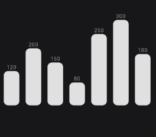
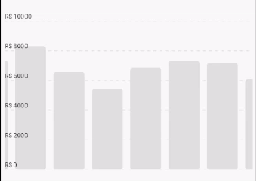
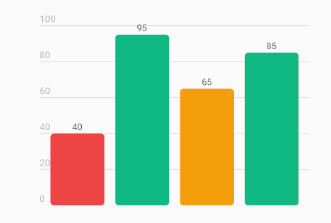
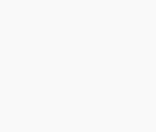

# 📈 React Native Financial Charts - Bar Chart

<p align="center">
  
</p>

The BarChart component is designed for high-performance rendering of categorical data. It uses batch rendering techniques to handle thousands of bars smoothly, supports horizontal scrolling (virtualization), and provides granular control over every visual element.

## ⚡ Basic Usage

```tsx
import { BarChart } from 'react-native-financial-charts';
import type { BarChartItemDataInterface } from 'react-native-financial-charts';
import { GestureHandlerRootView } from 'react-native-gesture-handler';

const data: BarChartItemDataInterface[] = [
  { label: 'Food 123 ABC', value: 1200, color: '#FF6B6B' }, // Red for expenses
  { label: 'Transport', value: 800, color: '#4ECDC4' }, // Teal
  { label: 'Invest', value: 3500, color: '#1A535C' }, // Dark Blue for savings
  { label: 'Invest', value: 3800, color: '#1A535C' }, // Dark Blue for savings
  { label: 'Rent', value: 2100, color: '#FFE66D' }, // Yellow
];

const App = () => {
  return (
    <GestureHandlerRootView style={{ flex: 1 }}>
      <BarChart.Root
        data={data}
        width={390}
        selectable
        showXAxis
        scrollToTheEnd
      >
        <BarChart.Canvas>
          <BarChart.Grid />
          <BarChart.Bar />
          <BarChart.Tooltip
            format={(value) => {
              'worklet';
              return value.toString();
            }}
          />
          <BarChart.YAxis labelColor="#FFF" labelBackgroundColor="#696969" />
        </BarChart.Canvas>
      </BarChart.Root>
    </GestureHandlerRootView>
  );
};
```

## 💡 Examples

Here are some common patterns to customize the chart to your needs.

### 1. Minimal Dashboard Widget (Fit Mode)

A clean chart that fits 100% of the container width without scrolling. Perfect for "Last 7 Days" summaries.

```tsx
import { BarChart } from 'react-native-financial-charts';

// Fixed small dataset
const last7DaysData = [
  { label: 'Mon', value: 120 },
  { label: 'Tue', value: 200 },
  { label: 'Wed', value: 150 },
  { label: 'Thu', value: 80 },
  { label: 'Fri', value: 250 },
  { label: 'Sat', value: 300 },
  { label: 'Sun', value: 180 },
];

export function MinimalWidget() {
  return (
    <BarChart.Root data={last7DaysData} height={200}>
      <BarChart.Canvas>
        <BarChart.Bar
          barBorderRadius={8}
          showValueLabels
          valueLabelColor="#888"
        />
      </BarChart.Canvas>
    </BarChart.Root>
  );
}
```



### 2. Scrollable Financial History

Ideal for monthly reports or long timelines. Features automatic scroll-to-end and currency formatting.

```tsx
import { BarChart } from 'react-native-financial-charts';
import type { BarChartItemDataInterface } from 'react-native-financial-charts';

const generateBarData = (
  count: number,
  min: number = 100,
  max: number = 5000,
  options?: {
    labelPrefix?: string;
    useRandomColors?: boolean;
  }
): BarChartItemDataInterface[] => {
  const prefix = options?.labelPrefix ?? 'Item';
  const colors = ['#FF6B6B', '#4ECDC4', '#1A535C', '#FFE66D', '#FF9F1C'];

  return Array.from({ length: count }, (_, index) => {
    const value = Math.floor(Math.random() * (max - min + 1)) + min;

    const item: BarChartItemDataInterface = {
      label: `${prefix} ${index + 1}`,
      value: value,
    };

    if (options?.useRandomColors) {
      item.color = colors[index % colors.length];
    }

    return item;
  });
};

// Generate 24 months of data
const historyData = generateBarData(24, 5000, 9000);

export function FinancialHistory() {
  const formatBRL = (val: number) => `R$ ${val.toFixed(0)}`;

  return (
    <BarChart.Root
      data={historyData}
      width={400}
      isScrollable
      scrollToTheEnd // Auto-scrolls to latest item
      barWidth={50}
    >
      <BarChart.Canvas>
        <BarChart.Grid dashEffect={[5, 5]} />
        <BarChart.Bar />
        <BarChart.YAxis formatLabel={formatBRL} labelColor="#000" />
        <BarChart.Tooltip />
      </BarChart.Canvas>
    </BarChart.Root>
  );
}
```



### 3. Conditional Coloring (Performance Scores)

You can define a specific color for each bar directly in the data object. This is useful for "RAG" (Red/Amber/Green) status charts.

```tsx
import { BarChart } from 'react-native-financial-charts';

const scoresData = [
  { label: 'Q1', value: 40, color: '#EF4444' }, // Red (Poor)
  { label: 'Q2', value: 95, color: '#10B981' }, // Green (Good)
  { label: 'Q3', value: 65, color: '#F59E0B' }, // Yellow (Average)
  { label: 'Q4', value: 85, color: '#10B981' }, // Green
];

export function PerformanceChart() {
  const formatBRL = (val: number) => `R$ ${val.toFixed(0)}`;

  return (
    <BarChart.Root data={scoresData} height={250}>
      <BarChart.Canvas>
        <BarChart.Grid />
        {/* Bars will use individual colors from data */}
        <BarChart.Bar showValueLabels />
        <BarChart.YAxis />
      </BarChart.Canvas>
    </BarChart.Root>
  );
}
```



### 4. Handling Loading States

Use the built-in skeleton support to provide a polished loading experience without extra code.

```tsx
import { BarChart } from 'react-native-financial-charts';
import { useState, useEffect } from 'react';
import type { BarChartItemDataInterface } from 'react-native-financial-charts';

const generateBarData = (
  count: number,
  min: number = 100,
  max: number = 5000,
  options?: {
    labelPrefix?: string;
    useRandomColors?: boolean;
  }
): BarChartItemDataInterface[] => {
  const prefix = options?.labelPrefix ?? 'Item';
  const colors = ['#FF6B6B', '#4ECDC4', '#1A535C', '#FFE66D', '#FF9F1C'];

  return Array.from({ length: count }, (_, index) => {
    const value = Math.floor(Math.random() * (max - min + 1)) + min;

    const item: BarChartItemDataInterface = {
      label: `${prefix} ${index + 1}`,
      value: value,
    };

    if (options?.useRandomColors) {
      item.color = colors[index % colors.length];
    }

    return item;
  });
};

export function AsyncChart() {
  const [data, setData] = useState([]);
  const [loading, setLoading] = useState(true);

  useEffect(() => {
    // Simulate API call
    setTimeout(() => {
      setData(generateBarData(10, 2, 10));
      setLoading(false);
    }, 2000);
  }, []);

  return (
    <BarChart.Root
      data={data}
      isLoading={loading} // Toggles skeleton mode
      height={300}
    >
      <BarChart.Canvas>
        <BarChart.Bar />
        <BarChart.YAxis />
      </BarChart.Canvas>
    </BarChart.Root>
  );
}
```



## 🔷 TypeScript Support

For advanced usage, you can import the following interfaces from react-native-financial-charts:

Complete interface reference:
[`docs/interfaces/BarChartInterfaces.md`](./interfaces/BarChartInterfaces.md)

### Component Props

If you are building wrappers around the chart components, use these interfaces:

- [`BarChartRootPropsInterface`](./interfaces/BarChartInterfaces.md#barchartrootpropsinterface): Props for `<BarChart.Root />`.
- [`BarChartBarPropsInterface`](./interfaces/BarChartInterfaces.md#barchartbarpropsinterface): Props for `<BarChart.Bar />`.
- [`BarChartGridPropsInterface`](./interfaces/BarChartInterfaces.md#barchartgridpropsinterface): Props for `<BarChart.Grid />`.
- [`BarChartYAXisPropsInterface`](./interfaces/BarChartInterfaces.md#barchartyaxispropsinterface): Props for `<BarChart.YAxis />`.
- [`BarChartTooltipPropsInterface`](./interfaces/BarChartInterfaces.md#barcharttooltippropsinterface): Props for `<BarChart.Tooltip />`.

### Data and Refs

- [`BarChartItemDataInterface`](./interfaces/BarChartInterfaces.md#barchartitemdatainterface): The shape of each object in the data array.
- [`BarChartRef`](./interfaces/BarChartInterfaces.md#barchartref): The type for the `useRef` when interacting with the chart programmatically.

```tsx
import { useRef } from 'react';
import {
  BarChartRef,
  BarChartItemDataInterface,
} from 'react-native-financial-charts';

const chartRef = useRef<BarChartRef>(null);

const onSelect = (item: BarChartItemDataInterface | null, index: number) => {
  console.log(item?.value);
};
```

## 🛠️ API Reference

### `<BarChart.Root />`

The provider component that manages state, layout, and gestures.

| Prop                  | Type                                                               | Default       | Description                                                                                |
| --------------------- | ------------------------------------------------------------------ | ------------- | ------------------------------------------------------------------------------------------ |
| `ref`                 | React.Ref<[BarChartRef](./interfaces/BarChartInterfaces.md#barchartref)>                                           | `undefined`   | Bar chart component ref.                                                                   |
| `data`                | [`BarChartItemDataInterface`](./interfaces/BarChartInterfaces.md#barchartitemdatainterface)[]                                       | **Required**  | Array of data points.                                                                      |
| `height`              | `number`                                                           | `300`         | Total height of the chart container.                                                       |
| `width`               | `number`                                                           | `300`         | Total width of the chart container.                                                        |
| `scrollToTheEnd`      | `boolean`                                                          | `false`       | If true, automatically scrolls to the end of the list on load.                             |
| `yAxisTicksCount`     | `number`                                                           | `5`           | Number of horizontal grid lines/ticks to calculate.                                        |
| `isLoading`           | `boolean`                                                          | `false`       | Enable loading skeleton.                                                                   |
| `barWidth`            | `number`                                                           | `32`          | Width of each individual bar in pixels.                                                    |
| `spacing`             | `number`                                                           | `12`          | Spacing between bars.                                                                      |
| `barColor`            | `string`                                                           | `#E0E0E0`     | Default bar color.                                                                         |
| `activeBorderColor`   | `string`                                                           | `#333333`     | Border color when a bar is selected/tapped.                                                |
| `activeBorderWidth`   | `number`                                                           | `2`           | Border width when a bar is selected/tapped.                                                |
| `font`                | `SkFont \| null`                                                   | `System Font` | Skia Font object for drawing labels. Essential for performance. If null, text won't render |
| `isScrollable`        | `boolean`                                                          | `false`       | Enables horizontal scrolling. Virtualization is automatically handled.                     |
| `selectable`          | `boolean`                                                          | `false`       | Controls if bars can be selected.                                                          |
| `showXAxis`           | `boolean`                                                          | `false`       | Show X Axis labels.                                                                        |
| `verticalScaleFactor` | `number`                                                           | `0.8`         | Vertical scale (0.1 to 1.0).                                                               |
| `onBarPress`          | (item: [BarChartItemDataInterface](./interfaces/BarChartInterfaces.md#barchartitemdatainterface) \| null, index: number) => void | `undefined`   | Callback fired when a bar is tapped (requires `selectable={true}`).                       |

### `BarChartRef` (Imperative API)

Use `ref` in `<BarChart.Root />` to control selection and scrolling programmatically.

```tsx
import React, { useRef } from 'react';
import { BarChart } from 'react-native-financial-charts';
import type { BarChartRef } from 'react-native-financial-charts';

const chartRef = useRef<BarChartRef>(null);

<BarChart.Root ref={chartRef} data={data} isScrollable>
  <BarChart.Canvas>
    <BarChart.Bar />
  </BarChart.Canvas>
</BarChart.Root>;
```

| Method          | Type                                                                                     | Description                                                                  |
| --------------- | ---------------------------------------------------------------------------------------- | ---------------------------------------------------------------------------- |
| `scrollToStart` | `(animated?: boolean) => void`                                                           | Scrolls to the start (`x = 0`).                                              |
| `scrollToEnd`   | `(animated?: boolean) => void`                                                           | Scrolls to the end of the content.                                           |
| `scrollToIndex` | `(index: number, animated?: boolean) => void`                                            | Scrolls to `index * (barWidth + spacing)`.                                   |
| `selectedIndex` | `(index: number, options?: { scrollToBar?: boolean; animatedScroll?: boolean }) => void` | Selects a bar by index (`-1` clears selection). Optional auto-center scroll. |

#### Method behavior notes

- `selectedIndex(index)` only updates when `index` is between `-1` and `data.length - 1`.
- `selectedIndex(-1)` clears the current selection.
- `selectedIndex(index, { scrollToBar: true })` only scrolls if `isScrollable` is enabled and `index !== -1`.
- `selectedIndex(..., { animatedScroll })` controls only the auto-scroll animation triggered by `scrollToBar`.
- `scrollToIndex(index)` clamps the target index to the valid data range.

---

### `<BarChart.Bar />`

Renders the visual bars, the X-Axis labels (bottom), and optional value labels (top).

| Prop                      | Type                        | Default     | Description                                                 |
| ------------------------- | --------------------------- | ----------- | ----------------------------------------------------------- |
| `labelPaddingTop`         | `number`                    | `4`         | Distance from the chart bottom to the label.                |
| `labelColor`              | `string`                    | `#555555`   | Color of the X-Axis text labels (bottom).                   |
| `barBorderRadius`         | `number`                    | `4`         | Radius of the bar corners.                                  |
| `showValueLabels`         | `boolean`                   | `false`     | Show the numeric value on top of each bar.                  |
| `valueLabelColor`         | `string`                    | `#555555`   | Color of the top value labels.                              |
| `valueLabelPaddingBottom` | `number`                    | `4`         | Distance between the top of the bar and the value label.    |
| `formatValueLabel`        | `(value: number) => string` | `undefined` | Function to format the top value label (runs on UI thread). |

---

### `<BarChart.Canvas />`

The container that renders the Skia Canvas and handles touch gestures/scrolling.

| Prop       | Type              | Default     | Description                                          |
| ---------- | ----------------- | ----------- | ---------------------------------------------------- |
| `children` | `React.ReactNode` | `-`         | Must contain the visual components (Bar, Grid, etc). |
| `style`    | `ViewStyle`       | `undefined` | Skia canvas styles.                                  |

---

### `<BarChart.Grid />`

Draws the horizontal background lines based on `yAxisTicksCount`.

| Prop         | Type       | Default     | Description                                          |
| ------------ | ---------- | ----------- | ---------------------------------------------------- |
| `lineColor`  | `string`   | `#E0E0E0`   | Grid line color.                                     |
| `lineWidth`  | `number`   | `1`         | The thickness of the grid lines in pixels.           |
| `dashEffect` | `number[]` | `undefined` | Dashed pattern (e.g., [5, 5] for 5px dash, 5px gap). |

---

### `<BarChart.Tooltip />`

The floating tooltip that appears when a bar is selected.

| Prop              | Type                                       | Default     | Description                         |
| ----------------- | ------------------------------------------ | ----------- | ----------------------------------- |
| `backgroundColor` | `string`                                   | `#333`      | Bubble background color.            |
| `textColor`       | `string`                                   | `#FFF`      | Text color.                         |
| `offsetY`         | `number`                                   | `0`         | Vertical offset adjustment.         |
| `font`            | `SkFont`                                   | `undefined` | Optional font override for tooltip. |
| `format`          | `(value: number, label: string) => string` | `undefined` | Worklet to format the tooltip text. |

---

### `<BarChart.YAxis />`

Renders the vertical axis labels on the left side.

| Prop                   | Type                        | Default                                  | Description                                                                 |
| ---------------------- | --------------------------- | ---------------------------------------- | --------------------------------------------------------------------------- |
| `width`                | `number`                    | `50`                                     | Reserved sidebar width used by `BarChart.Root` layout when YAxis is present. |
| `labelColor`           | `string`                    | `#9CA3AF`                                | Text color.                                                                 |
| `labelOffsetX`         | `number`                    | `0`                                      | Horizontal text offset.                                                     |
| `labelYOffset`         | `number`                    | `-4`                                     | Vertical text offset (positions label slightly above tick line).            |
| `snapToPixel`          | `boolean`                   | `false`                                  | Rounds Y position to nearest pixel for crisper lines/text.                 |
| `labelBackgroundColor` | `string`                    | `transparent`                            | Background color for text labels (pill effect).                            |
| `labelBorderRadius`    | `number`                    | `4`                                      | Border radius for label background.                                         |
| `labelPadding`         | `number`                    | `2`                                      | Internal padding for label background.                                      |
| `formatLabel`          | `(value: number) => string` | `system locale (max 6 fractional digits)` | Function to format numeric values.                                          |
