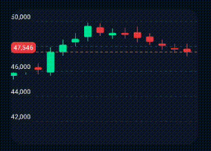
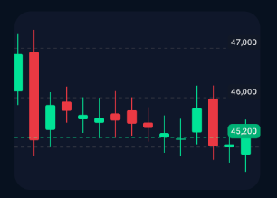
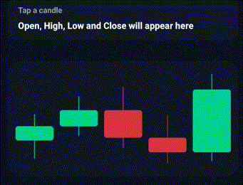
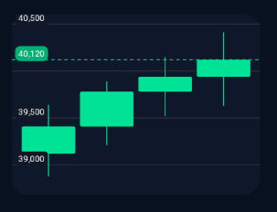
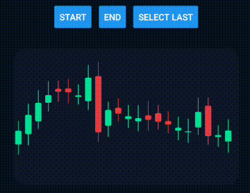
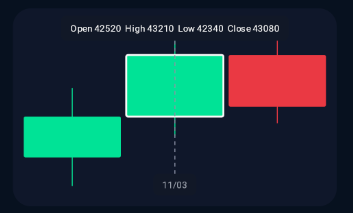

# 📈 React Native Financial Charts - Candlestick Chart

<p align="center">
  
</p>

The CandlestickChart component is built for OHLC financial series in React Native.
It supports horizontal scrolling, automatic vertical scaling based on the visible candles, tap selection, imperative control via `ref`, animated Y-axis transitions, and contextual tooltips for OHLC + date.

## ⚡ Basic Usage

```tsx
import { CandlestickChart } from 'react-native-financial-charts';
import type { CandlestickChartDataPoint } from 'react-native-financial-charts';
import { GestureHandlerRootView } from 'react-native-gesture-handler';

const data: CandlestickChartDataPoint[] = [
  {
    timestamp: new Date('2026-03-10T10:00:00').getTime(),
    open: 42150,
    high: 42780,
    low: 41890,
    close: 42520,
  },
  {
    timestamp: new Date('2026-03-11T10:00:00').getTime(),
    open: 42520,
    high: 43210,
    low: 42340,
    close: 43080,
  },
  {
    timestamp: new Date('2026-03-12T10:00:00').getTime(),
    open: 43080,
    high: 43320,
    low: 42460,
    close: 42610,
  },
];

export default function App() {
  return (
    <GestureHandlerRootView style={{ flex: 1 }}>
      <CandlestickChart.Root data={data} width={360} selectable isScrollable>
        <CandlestickChart.Canvas>
          <CandlestickChart.Grid dashEffect={[4, 4]} />
          <CandlestickChart.Candles />
          <CandlestickChart.LastPrice />
          <CandlestickChart.Cursor />
          <CandlestickChart.Tooltip.OHLC />
          <CandlestickChart.Tooltip.Date />
          <CandlestickChart.YAxis />
        </CandlestickChart.Canvas>
      </CandlestickChart.Root>
    </GestureHandlerRootView>
  );
}
```

## 💡 Examples

Here are some common patterns to help you ship a trading-style experience quickly.

### 1. Trading Layout With Scroll + Auto Vertical Zoom

Great for larger datasets. Horizontal pan changes the visible range, and the Y-axis auto-adjusts to the visible candles.

```tsx
import { CandlestickChart } from 'react-native-financial-charts';
import type { CandlestickChartDataPoint } from 'react-native-financial-charts';

const createCandlestickDataset = (
  totalPoints: number
): CandlestickChartDataPoint[] => {
  const startTimestamp = new Date('2026-02-01T10:00:00').getTime();
  let previousClose = 42180;

  return Array.from({ length: totalPoints }, (_, index) => {
    const trend = index * 92;
    const swing = Math.sin(index / 4) * 1350;
    const momentum = Math.cos(index / 2.2) * 420;
    const eventSpike = index % 11 === 0 ? 720 : index % 17 === 0 ? -860 : 0;
    const open = previousClose + Math.sin(index * 1.3) * 210;
    const close = 42200 + trend + swing + momentum + eventSpike;
    const high = Math.max(open, close) + 260 + (index % 5) * 48;
    const low = Math.min(open, close) - 240 - (index % 4) * 36;

    const candle = {
      timestamp: startTimestamp + index * 24 * 60 * 60 * 1000,
      open: Math.round(open),
      high: Math.round(high),
      low: Math.round(low),
      close: Math.round(close),
    };

    previousClose = candle.close;
    return candle;
  });
};

const data = createCandlestickDataset(48);

<CandlestickChart.Root
  data={data}
  width={360}
  height={220}
  isScrollable
  selectable
  scrollToTheEnd
  candleWidth={12}
  spacing={8}
>
  <CandlestickChart.Canvas
    style={{ backgroundColor: '#0F172A', borderRadius: 20 }}
  >
    <CandlestickChart.Grid dashEffect={[4, 4]} />
    <CandlestickChart.Candles />
    <CandlestickChart.LastPrice />
    <CandlestickChart.Cursor />
    <CandlestickChart.Tooltip.OHLC />
    <CandlestickChart.Tooltip.Date />
    <CandlestickChart.YAxis
      width={58}
      labelColor="#E5E7EB"
      labelBackgroundColor="#111827"
      labelPadding={4}
    />
  </CandlestickChart.Canvas>
</CandlestickChart.Root>;
```



### 2. Compact Selection Card

Use `onCandlePress` to drive UI outside the chart.

```tsx
import { useState } from 'react';
import { Text, View } from 'react-native';
import { CandlestickChart } from 'react-native-financial-charts';
import type { CandlestickChartDataPoint } from 'react-native-financial-charts';

const data: CandlestickChartDataPoint[] = [
  {
    timestamp: new Date('2026-03-14T10:00:00').getTime(),
    open: 44820,
    high: 45210,
    low: 44550,
    close: 45030,
  },
  {
    timestamp: new Date('2026-03-15T10:00:00').getTime(),
    open: 45030,
    high: 45480,
    low: 44890,
    close: 45270,
  },
  {
    timestamp: new Date('2026-03-16T10:00:00').getTime(),
    open: 45270,
    high: 45620,
    low: 44710,
    close: 44860,
  },
  {
    timestamp: new Date('2026-03-17T10:00:00').getTime(),
    open: 44860,
    high: 45190,
    low: 44480,
    close: 44640,
  },
  {
    timestamp: new Date('2026-03-18T10:00:00').getTime(),
    open: 44640,
    high: 45810,
    low: 44510,
    close: 45580,
  },
];

export default function CompactCandles() {
  const [selectedCandle, setSelectedCandle] =
    useState<CandlestickChartDataPoint | null>(null);

  return (
    <>
      <View
        style={{
          width: 360,
          backgroundColor: '#0F172A',
          borderRadius: 16,
          paddingHorizontal: 16,
          paddingVertical: 14,
          gap: 6,
        }}
      >
        <Text style={{ color: '#94A3B8', fontSize: 12, fontWeight: '600' }}>
          {selectedCandle ? 'Selected Candle' : 'Tap a candle'}
        </Text>
        <Text style={{ color: '#F8FAFC', fontSize: 14, fontWeight: '700' }}>
          {selectedCandle
            ? `O ${selectedCandle.open}  H ${selectedCandle.high}  L ${selectedCandle.low}  C ${selectedCandle.close}`
            : 'Open, High, Low and Close will appear here'}
        </Text>
      </View>

      <CandlestickChart.Root
        data={data}
        width={360}
        height={180}
        selectable
        candleWidth={22}
        spacing={10}
        onCandlePress={setSelectedCandle}
      >
        <CandlestickChart.Canvas
          style={{ backgroundColor: '#0F172A', borderRadius: 20 }}
        >
          <CandlestickChart.Candles candleBorderRadius={4} />
          <CandlestickChart.Cursor lineColor="#CBD5E1" />
          <CandlestickChart.Tooltip.Date offsetY={-30} />
        </CandlestickChart.Canvas>
      </CandlestickChart.Root>
    </>
  );
}
```



### 3. Left-Aligned Price Axis

`LastPrice` automatically follows the same alignment and inset rules from `YAxis` when a Y-axis is mounted.

```tsx
const data: CandlestickChartDataPoint[] = [
  {
    timestamp: new Date('2026-03-01T10:00:00').getTime(),
    open: 39120,
    high: 39640,
    low: 38880,
    close: 39410,
  },
  {
    timestamp: new Date('2026-03-02T10:00:00').getTime(),
    open: 39410,
    high: 39890,
    low: 39210,
    close: 39780,
  },
  {
    timestamp: new Date('2026-03-03T10:00:00').getTime(),
    open: 39780,
    high: 40150,
    low: 39520,
    close: 39940,
  },
  {
    timestamp: new Date('2026-03-04T10:00:00').getTime(),
    open: 39940,
    high: 40410,
    low: 39630,
    close: 40120,
  },
];

<CandlestickChart.Root data={data} width={360} height={220} selectable>
  <CandlestickChart.Canvas
    style={{ backgroundColor: '#0F172A', borderRadius: 20 }}
  >
    <CandlestickChart.Grid />
    <CandlestickChart.Candles />
    <CandlestickChart.LastPrice />
    <CandlestickChart.YAxis
      width={58}
      labelAlignment="left"
      labelOffsetX={8}
      labelColor="#E5E7EB"
      labelBackgroundColor="#111827"
      labelPadding={4}
    />
  </CandlestickChart.Canvas>
</CandlestickChart.Root>;
```



### 4. Imperative Control With `ref`

Useful for syncing buttons, tabs, or external navigation with the chart.

```tsx
import { useRef } from 'react';
import { Button, View } from 'react-native';
import { CandlestickChart } from 'react-native-financial-charts';
import type {
  CandlestickChartDataPoint,
  CandlestickChartRef,
} from 'react-native-financial-charts';

const createCandlestickDataset = (
  totalPoints: number
): CandlestickChartDataPoint[] => {
  const startTimestamp = new Date('2025-12-01T10:00:00').getTime();
  let previousClose = 42180;

  return Array.from({ length: totalPoints }, (_, index) => {
    const trend = index * 92;
    const swing = Math.sin(index / 4) * 1350;
    const momentum = Math.cos(index / 2.2) * 420;
    const eventSpike = index % 11 === 0 ? 720 : index % 17 === 0 ? -860 : 0;
    const open = previousClose + Math.sin(index * 1.3) * 210;
    const close = 42200 + trend + swing + momentum + eventSpike;
    const high = Math.max(open, close) + 260 + (index % 5) * 48;
    const low = Math.min(open, close) - 240 - (index % 4) * 36;

    const candle = {
      timestamp: startTimestamp + index * 24 * 60 * 60 * 1000,
      open: Math.round(open),
      high: Math.round(high),
      low: Math.round(low),
      close: Math.round(close),
    };

    previousClose = candle.close;
    return candle;
  });
};

const data = createCandlestickDataset(48);

export default function RefDrivenCandles() {
  const chartRef = useRef<CandlestickChartRef>(null);

  return (
    <>
      <View style={{ flexDirection: 'row', gap: 12 }}>
        <Button
          title="Start"
          onPress={() => chartRef.current?.scrollToStart()}
        />
        <Button title="End" onPress={() => chartRef.current?.scrollToEnd()} />
        <Button
          title="Select Last"
          onPress={() =>
            chartRef.current?.selectedIndex(data.length - 1, {
              scrollToCandle: true,
              animatedScroll: true,
            })
          }
        />
      </View>

      <CandlestickChart.Root
        ref={chartRef}
        data={data}
        width={360}
        height={220}
        isScrollable
        selectable
      >
        <CandlestickChart.Canvas
          style={{ backgroundColor: '#0F172A', borderRadius: 20 }}
        >
          <CandlestickChart.Candles />
          <CandlestickChart.Cursor />
          <CandlestickChart.Tooltip.OHLC />
          <CandlestickChart.Tooltip.Date />
        </CandlestickChart.Canvas>
      </CandlestickChart.Root>
    </>
  );
}
```



### 5. Custom Tooltip Formatters

Tooltip formatters run on the UI thread, so keep them worklet-safe.

```tsx
import { CandlestickChart } from 'react-native-financial-charts';
import type { CandlestickChartDataPoint } from 'react-native-financial-charts';

const data: CandlestickChartDataPoint[] = [
  {
    timestamp: new Date('2026-03-10T10:00:00').getTime(),
    open: 42150,
    high: 42780,
    low: 41890,
    close: 42520,
  },
  {
    timestamp: new Date('2026-03-11T10:00:00').getTime(),
    open: 42520,
    high: 43210,
    low: 42340,
    close: 43080,
  },
  {
    timestamp: new Date('2026-03-12T10:00:00').getTime(),
    open: 43080,
    high: 43320,
    low: 42460,
    close: 42610,
  },
];

const formatOHLC = (item: CandlestickChartDataPoint) => {
  'worklet';
  return `Open ${item.open}  High ${item.high}  Low ${item.low}  Close ${item.close}`;
};

const formatDate = (timestamp: number) => {
  'worklet';
  const date = new Date(timestamp);
  const day = date.getDate().toString().padStart(2, '0');
  const month = (date.getMonth() + 1).toString().padStart(2, '0');
  return `${day}/${month}`;
};

<CandlestickChart.Root data={data} width={360} height={220} selectable>
  <CandlestickChart.Canvas
    style={{ backgroundColor: '#0F172A', borderRadius: 20 }}
  >
    <CandlestickChart.Candles />
    <CandlestickChart.Cursor />
    <CandlestickChart.Tooltip.OHLC format={formatOHLC} />
    <CandlestickChart.Tooltip.Date format={formatDate} />
  </CandlestickChart.Canvas>
</CandlestickChart.Root>;
```



## 🎨 Behavior Notes

- `isScrollable` enables horizontal pan only.
- The vertical domain is recalculated from the visible candles and animated as you scroll.
- `selectable` is required for tap selection.
- `onCandlePress` is fired on selection and deselection, and also when selection changes through `ref.selectedIndex(...)`.
- `LastPrice` always uses the last candle from `data`.
- When `YAxis` is present, `LastPrice` inherits the axis alignment and inset rules by default.
- When `LastPrice` overlaps a Y-axis label, the overlapping axis label is hidden automatically to avoid visual collisions.
- `Tooltip.OHLC` and `Tooltip.Date` formatters run on the UI thread, so custom formatter functions should be worklet-safe.

## 🔷 TypeScript Support

Complete interface reference:
[`docs/interfaces/CandlestickChartInterfaces.md`](./interfaces/CandlestickChartInterfaces.md)

- [`CandlestickChartDataPoint`](./interfaces/CandlestickChartInterfaces.md#candlestickchartdatapoint)
- [`CandlestickChartRootPropsInterface`](./interfaces/CandlestickChartInterfaces.md#candlestickchartrootpropsinterface)
- [`CandlestickChartRef`](./interfaces/CandlestickChartInterfaces.md#candlestickchartref)
- [`CandlestickChartRefSelectedIndexOptions`](./interfaces/CandlestickChartInterfaces.md#candlestickchartrefselectedindexoptions)
- [`CandlestickChartCandlesPropsInterface`](./interfaces/CandlestickChartInterfaces.md#candlestickchartcandlespropsinterface)
- [`CandlestickChartCanvasPropsInterface`](./interfaces/CandlestickChartInterfaces.md#candlestickchartcanvaspropsinterface)
- [`CandlestickChartGridPropsInterface`](./interfaces/CandlestickChartInterfaces.md#candlestickchartgridpropsinterface)
- [`CandlestickChartYAxisPropsInterface`](./interfaces/CandlestickChartInterfaces.md#candlestickchartyaxispropsinterface)
- [`CandlestickChartCursorPropsInterface`](./interfaces/CandlestickChartInterfaces.md#candlestickchartcursorpropsinterface)
- [`CandlestickChartLastPricePropsInterface`](./interfaces/CandlestickChartInterfaces.md#candlestickchartlastpricepropsinterface)
- [`CandlestickChartTooltipOHLCPropsInterface`](./interfaces/CandlestickChartInterfaces.md#candlestickcharttooltipohlcpropsinterface)
- [`CandlestickChartTooltipDatePropsInterface`](./interfaces/CandlestickChartInterfaces.md#candlestickcharttooltipdatepropsinterface)

## 🛠️ API Reference

### `<CandlestickChart.Root />`

| Prop                | Type                                                               | Default       | Description                                                         |
| ------------------- | ------------------------------------------------------------------ | ------------- | ------------------------------------------------------------------- |
| `ref`               | `React.Ref<CandlestickChartRef>`                                   | `undefined`   | Imperative API for scrolling and selection.                         |
| `data`              | `CandlestickChartDataPoint[]`                                      | **Required**  | OHLC dataset.                                                       |
| `width`             | `number`                                                           | `300`         | Chart width.                                                        |
| `height`            | `number`                                                           | `280`         | Chart height.                                                       |
| `candleWidth`       | `number`                                                           | `10`          | Candle body width.                                                  |
| `spacing`           | `number`                                                           | `6`           | Space between candles.                                              |
| `scrollToTheEnd`    | `boolean`                                                          | `false`       | Auto-scrolls to the latest candle on mount and when `data` changes. |
| `isScrollable`      | `boolean`                                                          | `false`       | Enables horizontal scrolling.                                       |
| `selectable`        | `boolean`                                                          | `false`       | Enables candle selection by tap.                                    |
| `yAxisTicksCount`   | `number`                                                           | `5`           | Number of ticks used to generate the Y-axis and grid.               |
| `bullishColor`      | `string`                                                           | `#00E396`     | Default bullish candle color.                                       |
| `bearishColor`      | `string`                                                           | `#EA3943`     | Default bearish candle color.                                       |
| `activeBorderColor` | `string`                                                           | `#F9FAFB`     | Selected candle border color.                                       |
| `activeBorderWidth` | `number`                                                           | `2`           | Selected candle border width.                                       |
| `font`              | `SkFont \| null`                                                   | `System Font` | Optional label and tooltip font override.                           |
| `onCandlePress`     | `(item: CandlestickChartDataPoint \| null, index: number) => void` | `undefined`   | Callback fired on selection or deselection.                         |

Notes:

- `scrollToTheEnd` only has visible effect when `isScrollable` is `true`.
- The chart auto-scales vertically according to the currently visible candles.
- Entries with non-finite `timestamp`, `open`, `high`, `low`, or `close` values are ignored before layout and interaction.
- `onCandlePress` is fired by touch selection and also by `ref.selectedIndex(...)`.

### `CandlestickChartRef`

| Method          | Type                                                                                        | Description                                             |
| --------------- | ------------------------------------------------------------------------------------------- | ------------------------------------------------------- |
| `scrollToStart` | `(animated?: boolean) => void`                                                              | Scrolls to the first candle.                            |
| `scrollToEnd`   | `(animated?: boolean) => void`                                                              | Scrolls to the latest candle.                           |
| `scrollToIndex` | `(index: number, animated?: boolean) => void`                                               | Scrolls to a candle index.                              |
| `selectedIndex` | `(index: number, options?: { scrollToCandle?: boolean; animatedScroll?: boolean }) => void` | Selects a candle by index. Use `-1` to clear selection. |

Notes:

- All indices refer to the normalized/rendered dataset after invalid entries are filtered out.
- `scrollToStart`, `scrollToEnd`, and `scrollToIndex` only have visible effect when `isScrollable` is `true`.
- `selectedIndex(-1)` clears the current selection.
- `selectedIndex(index, { scrollToCandle: true })` recenters the target candle only when `isScrollable` is `true`.
- `selectedIndex(...)` triggers `onCandlePress` with the selected item, or `null` when clearing.

### `<CandlestickChart.Canvas />`

| Prop       | Type              | Default     | Description                                          |
| ---------- | ----------------- | ----------- | ---------------------------------------------------- |
| `children` | `React.ReactNode` | `-`         | Skia children.                                       |
| `style`    | `ViewStyle`       | `undefined` | Optional container styles applied around the canvas. |

### `<CandlestickChart.Candles />`

| Prop                 | Type     | Default | Description                  |
| -------------------- | -------- | ------- | ---------------------------- |
| `wickWidth`          | `number` | `1`     | Wick width in pixels.        |
| `candleBorderRadius` | `number` | `2`     | Candle body radius.          |
| `minBodyHeight`      | `number` | `1`     | Minimum visible body height. |

### `<CandlestickChart.Grid />`

| Prop         | Type       | Default     | Description          |
| ------------ | ---------- | ----------- | -------------------- |
| `lineColor`  | `string`   | `#2F3340`   | Grid line color.     |
| `lineWidth`  | `number`   | `1`         | Grid line thickness. |
| `dashEffect` | `number[]` | `undefined` | Dash pattern.        |

### `<CandlestickChart.YAxis />`

| Prop                   | Type                        | Default         | Description                                                                          |
| ---------------------- | --------------------------- | --------------- | ------------------------------------------------------------------------------------ |
| `width`                | `number`                    | `50`            | Reserved Y-axis width. When mounted, this width is removed from the drawable canvas. |
| `labelColor`           | `string`                    | `#9CA3AF`       | Label text color.                                                                    |
| `labelAlignment`       | `'left' \| 'right'`         | `'right'`       | Horizontal alignment for Y-axis labels.                                              |
| `labelOffsetX`         | `number`                    | `0`             | Horizontal text offset.                                                              |
| `labelYOffset`         | `number`                    | `-4`            | Vertical label offset.                                                               |
| `snapToPixel`          | `boolean`                   | `false`         | Rounds Y positions to the nearest pixel.                                             |
| `labelBackgroundColor` | `string`                    | `transparent`   | Label background color.                                                              |
| `labelBorderRadius`    | `number`                    | `4`             | Label background radius.                                                             |
| `labelPadding`         | `number`                    | `2`             | Label background padding.                                                            |
| `formatLabel`          | `(value: number) => string` | `system locale` | Numeric formatter.                                                                   |

### `<CandlestickChart.Cursor />`

| Prop        | Type     | Default   | Description                 |
| ----------- | -------- | --------- | --------------------------- |
| `lineColor` | `string` | `#858CA2` | Vertical cursor line color. |
| `lineWidth` | `number` | `1`       | Cursor line thickness.      |

Notes:

- The cursor is only visible while a candle is selected.

### `<CandlestickChart.LastPrice />`

| Prop                     | Type                        | Default                        | Description                                                         |
| ------------------------ | --------------------------- | ------------------------------ | ------------------------------------------------------------------- |
| `lineColor`              | `string`                    | `last candle color`            | Optional override for the last price line and pill.                 |
| `lineWidth`              | `number`                    | `1`                            | Last price line thickness.                                          |
| `dashEffect`             | `number[]`                  | `[4, 4]`                       | Dash pattern for the horizontal line.                               |
| `textColor`              | `string`                    | `#F8FAFC`                      | Last price label text color.                                        |
| `labelBackgroundColor`   | `string`                    | `darkened lineColor`           | Background color for the price pill.                                |
| `labelBorderRadius`      | `number`                    | `6`                            | Price pill border radius.                                           |
| `labelPaddingHorizontal` | `number`                    | `matches the YAxis inset or 8` | Horizontal padding inside the price pill.                           |
| `labelPaddingVertical`   | `number`                    | `matches YAxis padding or 4`   | Vertical padding inside the price pill.                             |
| `rightOffset`            | `number`                    | `0`                            | Additional horizontal offset applied from the current aligned edge. |
| `formatLabel`            | `(value: number) => string` | `system locale`                | Formatter for the last close price shown in the pill.               |

Notes:

- `LastPrice` always renders the close price from the last rendered candle after normalization.
- When `YAxis` is mounted, `LastPrice` inherits its alignment, offset, and inset rules by default.
- By default, the price pill uses a darkened version of the line color to improve text contrast.
- Overlapping Y-axis labels are suppressed automatically while the price pill is occupying the same space.

### `<CandlestickChart.Tooltip.OHLC />`

| Prop              | Type                                          | Default     | Description                            |
| ----------------- | --------------------------------------------- | ----------- | -------------------------------------- |
| `backgroundColor` | `string`                                      | `#111827`   | Tooltip background color.              |
| `textColor`       | `string`                                      | `#F9FAFB`   | Tooltip text color.                    |
| `offsetY`         | `number`                                      | `8`         | Top offset for the OHLC tooltip.       |
| `font`            | `SkFont`                                      | `undefined` | Optional tooltip font override.        |
| `format`          | `(item: CandlestickChartDataPoint) => string` | `undefined` | OHLC formatter. Runs on the UI thread. |

Notes:

- This tooltip is only visible while a candle is selected.
- Custom `format` functions should be worklet-safe.

### `<CandlestickChart.Tooltip.Date />`

| Prop              | Type                            | Default     | Description                            |
| ----------------- | ------------------------------- | ----------- | -------------------------------------- |
| `backgroundColor` | `string`                        | `#111827`   | Tooltip background color.              |
| `textColor`       | `string`                        | `#9CA3AF`   | Tooltip text color.                    |
| `offsetY`         | `number`                        | `-36`       | Bottom offset for the date tooltip.    |
| `font`            | `SkFont`                        | `undefined` | Optional tooltip font override.        |
| `format`          | `(timestamp: number) => string` | `undefined` | Date formatter. Runs on the UI thread. |

Notes:

- This tooltip is only visible while a candle is selected.
- Custom `format` functions should be worklet-safe.
