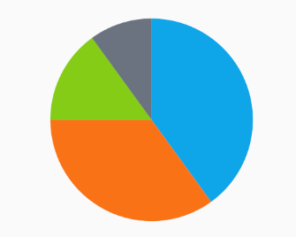
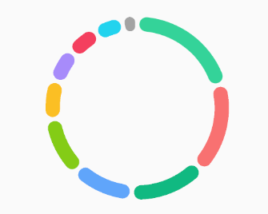
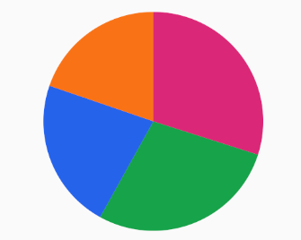
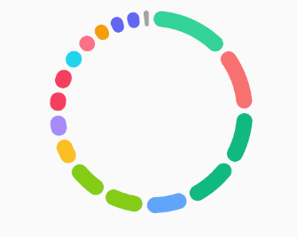
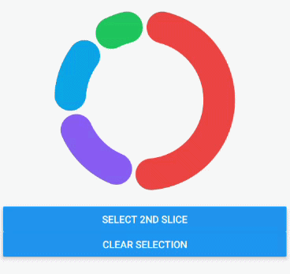

# 📈 React Native Financial Charts - Pie Chart

<p align="center">
  
</p>

The PieChart component is built for high-performance, interactive proportional visualizations in React Native.
It supports donut and pie modes, slice selection, aggregated "Others" behavior for large datasets, and rendering based on Skia paths generated via d3.

## ⚡ Basic Usage

```tsx
import React from 'react';
import { PieChart } from 'react-native-financial-charts';
import { GestureHandlerRootView } from 'react-native-gesture-handler';
import type { PieChartItem } from 'react-native-financial-charts';

const data: PieChartItem[] = [
  { label: 'Rent', value: 1200, color: '#f87171' },
  { label: 'Food', value: 800, color: '#60a5fa' },
  { label: 'Savings', value: 1500, color: '#34d399' },
  { label: 'Entertainment', value: 500, color: '#fbbf24' },
];

export default function App() {
  return (
    <GestureHandlerRootView style={{ flex: 1, justifyContent: 'center' }}>
      <PieChart.Root data={data} size={300}>
        <PieChart.Canvas>
          <PieChart.Slices rounded />
        </PieChart.Canvas>
      </PieChart.Root>
    </GestureHandlerRootView>
  );
}
```

## 💡 Examples

### 1. Clean Donut (Dashboard Default)

A balanced donut with rounded corners and smooth selection.

```tsx
const data = [
  { label: 'Rent', value: 1200, color: '#f87171' },
  { label: 'Food', value: 800, color: '#60a5fa' },
  { label: 'Savings', value: 1500, color: '#34d399' },
  { label: 'Entertainment', value: 500, color: '#fbbf24' },
];

<PieChart.Root data={data} size={300}>
  <PieChart.Canvas selectable>
    <PieChart.Slices rounded />
  </PieChart.Canvas>
</PieChart.Root>;
```


### 2. Minimal Pie (No Hole)

For dense visual proportions, force pie behavior by using large `sliceThickness`.

```tsx
const data = [
  { label: 'Crypto', value: 35, color: '#f97316' },
  { label: 'Stocks', value: 40, color: '#0ea5e9' },
  { label: 'Bonds', value: 15, color: '#84cc16' },
  { label: 'Cash', value: 10, color: '#6b7280' },
];

<PieChart.Root data={data} size={300}>
  <PieChart.Canvas sliceThickness={300}>
    <PieChart.Slices />
  </PieChart.Canvas>
</PieChart.Root>;
```



### 3. Start Angle + Direction

Control where the chart starts and its drawing direction.

```tsx
const data = [
  { label: 'North', value: 28, color: '#ef4444' },
  { label: 'South', value: 22, color: '#3b82f6' },
  { label: 'East', value: 30, color: '#10b981' },
  { label: 'West', value: 20, color: '#eab308' },
];

<PieChart.Root
  data={data}
  startAngle={-90}
  direction="counterclockwise"
  size={300}
>
  <PieChart.Canvas>
    <PieChart.Slices rounded />
  </PieChart.Canvas>
</PieChart.Root>;
```


### 4. Custom Selection Offset

Increase the selected slice offset for stronger feedback.

```tsx
const data = [
  { label: 'Marketing', value: 1400, color: '#06b6d4' },
  { label: 'Engineering', value: 2800, color: '#6366f1' },
  { label: 'Sales', value: 1900, color: '#f43f5e' },
  { label: 'Support', value: 900, color: '#14b8a6' },
];

<PieChart.Root data={data} size={300}>
  <PieChart.Canvas selectable selectedSliceOffset={18}>
    <PieChart.Slices rounded selectedSliceOffset={18} />
  </PieChart.Canvas>
</PieChart.Root>;
```

### 5. Automatic Others Aggregation

Useful when data has many small categories.

```tsx
const largeDataset = [
  { label: 'Rent', value: 1200, color: '#f87171' },
  { label: 'Food', value: 800, color: '#60a5fa' },
  { label: 'Savings', value: 1500, color: '#34d399' },
  { label: 'Entertainment', value: 500, color: '#fbbf24' },
  { label: 'Transport', value: 420, color: '#a78bfa' },
  { label: 'Health', value: 350, color: '#22d3ee' },
  { label: 'Education', value: 320, color: '#fb7185' },
  { label: 'Subscriptions', value: 280, color: '#f59e0b' },
  { label: 'Pets', value: 180, color: '#14b8a6' },
  { label: 'Travel', value: 760, color: '#84cc16' },
  { label: 'Clothes', value: 260, color: '#6366f1' },
  { label: 'Gifts', value: 140, color: '#06b6d4' },
  { label: 'Utilities', value: 390, color: '#f43f5e' },
  { label: 'Investments', value: 1000, color: '#10b981' },
];

<PieChart.Root data={largeDataset} maxSlices={10}>
  <PieChart.Canvas>
    <PieChart.Slices rounded sliceThickness={20} />
  </PieChart.Canvas>
</PieChart.Root>;
```



### 6. Visual Weight Control for Others

Keep "Others" visually small while preserving real value in callbacks.

```tsx
const largeDataset = [
  { label: 'Rent', value: 1200, color: '#f87171' },
  { label: 'Food', value: 800, color: '#60a5fa' },
  { label: 'Savings', value: 1500, color: '#34d399' },
  { label: 'Entertainment', value: 500, color: '#fbbf24' },
  { label: 'Transport', value: 420, color: '#a78bfa' },
  { label: 'Health', value: 350, color: '#22d3ee' },
  { label: 'Education', value: 320, color: '#fb7185' },
  { label: 'Subscriptions', value: 280, color: '#f59e0b' },
  { label: 'Pets', value: 180, color: '#14b8a6' },
  { label: 'Travel', value: 760, color: '#84cc16' },
  { label: 'Clothes', value: 260, color: '#6366f1' },
  { label: 'Gifts', value: 140, color: '#06b6d4' },
  { label: 'Utilities', value: 390, color: '#f43f5e' },
  { label: 'Investments', value: 1000, color: '#10b981' },
];

<PieChart.Root
  data={largeDataset}
  maxSlices={10}
  othersVisualAngle={10}
  othersLabel="Other categories"
  othersColor="#9CA3AF"
>
  <PieChart.Canvas>
    <PieChart.Slices rounded />
  </PieChart.Canvas>
</PieChart.Root>;
```

### 7. Optional Color / Label Data

`color` and `label` are optional; the chart generates deterministic fallback colors.

```tsx
const data = [
  { value: 1200 },
  { value: 800 },
  { value: 1500 },
  { value: 500 },
];

<PieChart.Root data={data}>
  <PieChart.Canvas>
    <PieChart.Slices rounded />
  </PieChart.Canvas>
</PieChart.Root>;
```


### 8. Donut-to-Pie Threshold Tuning

Control when donut should automatically become pie.

```tsx
const data = [
  { label: 'Jan', value: 980, color: '#2563eb' },
  { label: 'Feb', value: 1240, color: '#16a34a' },
  { label: 'Mar', value: 870, color: '#f97316' },
  { label: 'Apr', value: 1320, color: '#db2777' },
];

<PieChart.Root data={data} size={320}>
  <PieChart.Canvas>
    <PieChart.Slices rounded sliceThickness={150} />
  </PieChart.Canvas>
</PieChart.Root>;
```



### 9. Aggregated Slice Callback

Receive both the aggregated slice and its original grouped items.

```tsx
const largeDataset = [
  { label: 'Rent', value: 1200, color: '#f87171' },
  { label: 'Food', value: 800, color: '#60a5fa' },
  { label: 'Savings', value: 1500, color: '#34d399' },
  { label: 'Entertainment', value: 500, color: '#fbbf24' },
  { label: 'Transport', value: 420, color: '#a78bfa' },
  { label: 'Health', value: 350, color: '#22d3ee' },
  { label: 'Education', value: 320, color: '#fb7185' },
  { label: 'Subscriptions', value: 280, color: '#f59e0b' },
  { label: 'Pets', value: 180, color: '#14b8a6' },
  { label: 'Travel', value: 760, color: '#84cc16' },
  { label: 'Clothes', value: 260, color: '#6366f1' },
  { label: 'Gifts', value: 140, color: '#06b6d4' },
  { label: 'Utilities', value: 390, color: '#f43f5e' },
  { label: 'Investments', value: 1000, color: '#10b981' },
];

<PieChart.Root
  data={largeDataset}
  onSelect={(item, index) => {
    console.log('Selected slice', index, item?.value);
  }}
  onSelectAggregated={(item, index, groupedItems) => {
    console.log('Aggregated slice selected', index, item.value);
    console.log('Grouped items count', groupedItems.length);
  }}
>
  <PieChart.Canvas selectable>
    <PieChart.Slices rounded sliceThickness={20} />
  </PieChart.Canvas>
</PieChart.Root>;
```



### 10. Programmatic Selection via Ref

Select slices from external UI controls.

```tsx
import React, { useRef } from 'react';
import { Button, View } from 'react-native';
import { PieChart } from 'react-native-financial-charts';
import type { PieChartItem, PieChartRef } from 'react-native-financial-charts';

const data: PieChartItem[] = [
  { label: 'Housing', value: 2100, color: '#ef4444' },
  { label: 'Mobility', value: 650, color: '#0ea5e9' },
  { label: 'Leisure', value: 780, color: '#8b5cf6' },
  { label: 'Health', value: 430, color: '#22c55e' },
];

const chartRef = useRef<PieChartRef>(null);

<View>
  <PieChart.Root ref={chartRef} data={data}>
    <PieChart.Canvas>
      <PieChart.Slices rounded />
    </PieChart.Canvas>
  </PieChart.Root>

  <Button
    title="Select 2nd slice"
    onPress={() => chartRef.current?.selectedIndex(1)}
  />
  <Button
    title="Clear selection"
    onPress={() => chartRef.current?.clearSelection()}
  />
</View>;
```



## 🔷 TypeScript Support

For advanced usage, you can import the following types from `react-native-financial-charts`:

Complete interface reference:
[`docs/interfaces/PieChartInterfaces.md`](./interfaces/PieChartInterfaces.md)

### Core Types

- [`PieChartItem`](./interfaces/PieChartInterfaces.md#piechartitem)
- [`PieChartRef`](./interfaces/PieChartInterfaces.md#piechartref)
- [`PieChartRootPropsInterface`](./interfaces/PieChartInterfaces.md#piechartrootpropsinterface)

### Component Props

- [`PieChartCanvasPropsInterface`](./interfaces/PieChartInterfaces.md#piechartcanvaspropsinterface)
- [`PieChartSlicesPropsInterface`](./interfaces/PieChartInterfaces.md#piechartslicespropsinterface)

```tsx
import type {
  PieChartItem,
  PieChartRef,
  PieChartRootPropsInterface,
} from 'react-native-financial-charts';
```

## 🛠️ API Reference

### `<PieChart.Root />`

Provider component responsible for data processing, aggregation, and imperative selection API.

| Prop                 | Type                                                                        | Default            | Description                                                  |
| -------------------- | --------------------------------------------------------------------------- | ------------------ | ------------------------------------------------------------ |
| `ref`                | React.Ref<[PieChartRef](./interfaces/PieChartInterfaces.md#piechartref)>                                                    | `undefined`        | Imperative API (`selectedIndex`, `clearSelection`).          |
| `data`               | [`PieChartItem`](./interfaces/PieChartInterfaces.md#piechartitem)[]                                                            | **Required**       | Input slices (value required, label/color optional).         |
| `size`               | `number`                                                                    | `300`              | Chart width and height (square).                             |
| `donutRatio`         | `number`                                                                    | `0.65`             | Inner radius ratio for donut mode.                           |
| `startAngle`         | `number`                                                                    | `0`                | Start angle in degrees.                                      |
| `direction`          | `'clockwise' \| 'counterclockwise'`                                         | `'clockwise'`      | Slice progression direction.                                 |
| `sliceGapAngle`      | `number`                                                                    | `2`                | Gap between slices in degrees.                               |
| `maxSlices`          | `number`                                                                    | `auto by geometry` | Hard cap for rendered slices, including aggregated "Others". |
| `minSliceAngle`      | `number`                                                                    | `6`                | Minimum angle for a standalone slice before aggregation.     |
| `othersLabel`        | `string`                                                                    | `'Others'`         | Label for aggregated slice.                                  |
| `othersColor`        | `string`                                                                    | `'#A3A3A3'`        | Color for aggregated slice.                                  |
| `othersVisualAngle`  | `number`                                                                    | `auto`             | Optional visual angle override for "Others".                 |
| `onSelect`           | (item: [PieChartItem](./interfaces/PieChartInterfaces.md#piechartitem) \| null, index: number) => void                       | `undefined`        | Called on selection/deselection.                             |
| `onSelectAggregated` | (item: [PieChartItem](./interfaces/PieChartInterfaces.md#piechartitem), index: number, groupedItems: [PieChartItem](./interfaces/PieChartInterfaces.md#piechartitem)[]) => void | `undefined`        | Called when aggregated slice is selected.                    |

Notes:
- Selection callbacks are triggered by user interaction only when `PieChart.Canvas` uses `selectable={true}`.
- You can also trigger the same callbacks programmatically via `PieChartRef` methods.

### `PieChartRef` (Imperative API)

Use `ref` in `<PieChart.Root />` to control slice selection externally.

```tsx
import React, { useRef } from 'react';
import { PieChart } from 'react-native-financial-charts';
import type { PieChartRef } from 'react-native-financial-charts';

const chartRef = useRef<PieChartRef>(null);

<PieChart.Root ref={chartRef} data={data}>
  <PieChart.Canvas>
    <PieChart.Slices rounded />
  </PieChart.Canvas>
</PieChart.Root>;
```

| Method           | Type                      | Description                                                   |
| ---------------- | ------------------------- | ------------------------------------------------------------- |
| `selectedIndex`  | `(index: number) => void` | Selects a slice by index (`-1` clears selection).             |
| `clearSelection` | `() => void`              | Clears current selection (equivalent to `selectedIndex(-1)`). |

#### Method behavior notes

- `selectedIndex(index)` accepts values from `-1` to `data.length - 1` (after aggregation processing).
- Invalid indices are ignored (no selection update).
- `selectedIndex(-1)` and `clearSelection()` both trigger deselection callbacks.
- If data changes, current selection is automatically reset to avoid stale indices.

---

### `<PieChart.Canvas />`

Handles gestures, hit-test, and shared layout provisioning to avoid duplicated heavy calculations.

Interface: [`PieChartCanvasPropsInterface`](./interfaces/PieChartInterfaces.md#piechartcanvaspropsinterface)

| Prop                  | Type              | Default     | Description                                          |
| --------------------- | ----------------- | ----------- | ---------------------------------------------------- |
| `children`            | `React.ReactNode` | -           | Skia children (usually `PieChart.Slices`).           |
| `rounded`             | `boolean`         | `false`     | Enables rounded corners in donut mode.               |
| `sliceThickness`      | `number`          | `auto`      | Arc thickness. Can force donut-to-pie behavior.      |
| `sliceGapAngle`       | `number`          | `from Root` | Visual gap between slices.                           |
| `selectedSliceOffset` | `number`          | `12`        | Distance (px) selected slice moves away from center. |
| `minDonutHoleRatio`   | `number`          | `0.6`       | Threshold ratio for automatic donut-to-pie switch.   |
| `selectable`          | `boolean`         | `false`     | Enables/disables tap selection.                      |

---

### `<PieChart.Slices />`

Renders the actual pie/donut paths and selection/reveal animations.

Interface: [`PieChartSlicesPropsInterface`](./interfaces/PieChartInterfaces.md#piechartslicespropsinterface)

| Prop                  | Type      | Default     | Description                            |
| --------------------- | --------- | ----------- | -------------------------------------- |
| `rounded`             | `boolean` | `false`     | Enables rounded corners in donut mode. |
| `sliceThickness`      | `number`  | `auto`      | Arc thickness override.                |
| `sliceGapAngle`       | `number`  | `from Root` | Visual gap override.                   |
| `selectedSliceOffset` | `number`  | `12`        | Selection offset override.             |
| `minDonutHoleRatio`   | `number`  | `0.6`       | Donut-to-pie threshold override.       |

## 📌 Notes

- If `color` is omitted in `PieChartItem`, a deterministic fallback color is generated.
- If `label` is omitted, rendering still works normally.
- Aggregation affects what is rendered, but `value` remains the real data value passed to callbacks.
- For maximum performance, keep data arrays stable when possible (memoization in parent screens).
